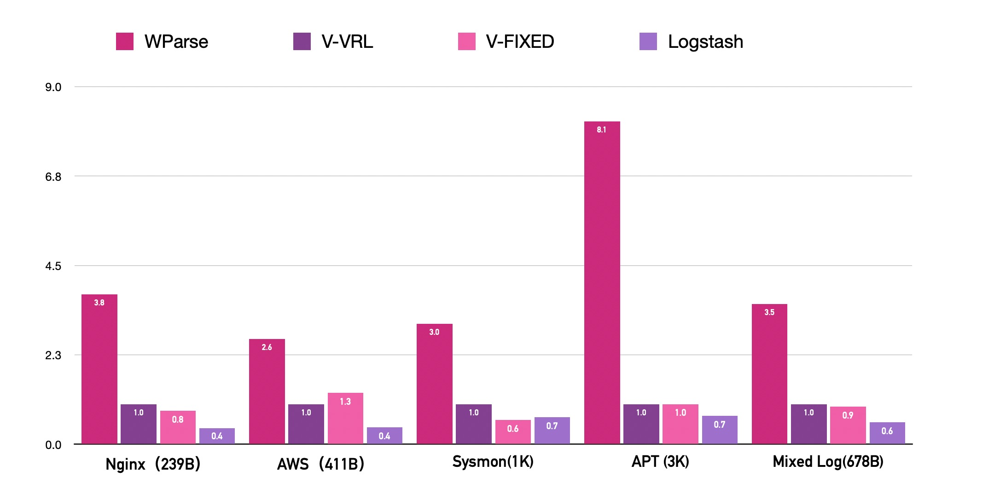

<p align="center">
  
</p>

<h1 align="center">Warp Parse</h1>

<p align="center">
  <a href="https://github.com/wp-labs/warp-parse/actions/workflows/build-and-test.yml">
    
  </a>
  <a href="https://github.com/wp-labs/warp-parse/actions/workflows/release.yml">
    
  </a>
  <a href="https://www.apache.org/licenses/LICENSE-2.0">
    
  </a>
</p>

---

Warp Parse is a high-performance Rust ETL engine built for observability, security, real-time risk control, and data platform teams. It focuses on log/telemetry ingestion, parsing, and transformation, providing extreme throughput parsing (WPL), transformation (OML), routing, unified connector APIs, and streamlined operations.

> 📚 **Documentation:** `docs/` (mdBook) • 📊 **Performance:** `docs/performance.md`

## ✨ Core Features

- **🚀 Extreme throughput:** Outperforms Vector across numerous scenarios (see `docs/performance.md`).
- **📝 Readable rules:** WPL (parse DSL) + OML (transform DSL) offer far better readability than regular expressions and Lua.
- **🔌 Unified connectors:** Based on `wp-connector-api` for easy community ecosystem extension.
- **🛠️ Ops friendly:** Single binary deployment, configuration-based; provides `wproj`, `wpgen`, `wprescue` tool suite.
- **🧠 Knowledge transformation:** Enables data enrichment through SQL queries with in-memory database.
- **🎯 Data routing:** Routes data based on rules and transformation models, supports multi-path replication and filters.

## Performance
WarpParse VS Vector、LogStash [Report](https://example.warpparse.ai/benchmark/report/report_mac.html)
<p align="center">
  
</p>

## Setup

```bash
#stable version:
curl  -sSf https://get.warpparse.ai/setup.sh | bash
#beta version:
curl  -sSf https://get.warpparse.ai/beta_setup.sh | bash
#alpha version: 
curl  -sSf https://get.warpparse.ai/alpha_setup.sh | bash

```

## 🤝 Community & Collaboration

### 1. Developer Contributions
We welcome all developers to participate in WarpParse development, whether it's feature development, bug fixes, or documentation improvements:
- Contribution Guide: [CONTRIBUTING.md](CONTRIBUTING.md) (For initial release, simple PR/Issue submission process)
- Issue Tracking: [GitHub Issues](https://github.com/wp-labs/warp-parse/issues)
- Community Discussion: GitHub Discussions

### 2. Enterprise/Vendor Partnerships
If your product is a **security threat detection platform, operations observability system, or cloud-native logging service** and requires high-performance log parsing capabilities:
- You can directly integrate WarpParse open-source edition - we provide free technical documentation support;
- For customized adaptation or joint solution testing, contact us via: coop@warpparse.ai
> Note: After integration, simply mention "Built with WarpParse high-performance log parsing engine" in your product documentation - no additional authorization required.

## 📄 License

Apache License 2.0 - see [LICENSE](LICENSE) for details.

---

# Warp Parse（中文版）

<p align="center">
  <strong>高性能 Rust ETL 引擎，专为极致日志处理而设计</strong>
</p>

---

Warp Parse 是面向可观测性、安全、实时风控、数据平台团队的高性能 ETL 引擎，专注于日志/事件接入、解析与转换，提供高吞吐解析（WPL）、转换（OML）、路由、统一连接器 API 及极简运维体验。

> 📚 **文档位置：** `docs/` (mdBook) • 📊 **性能数据：** `docs/performance.md`

## ✨ 核心特性

- **🚀 极致吞吐：** 众多场景下性能全面超越 Vector（详见 `docs/performance.md`）。
- **📝 规则易编写：** WPL（解析 DSL）+ OML（转换 DSL），可读性远超正则表达式和 Lua。
- **🔌 连接器统一：** 基于 `wp-connector-api`，便于社区生态扩展。
- **🛠️ 运维友好：** 单二进制部署，配置化；提供 `wproj`、`wpgen`、`wprescue` 工具套件。
- **🧠 知识转换：** 通过内存数据库支持 SQL 查询，实现数据富化。
- **🎯 数据路由：** 基于规则和转换模型进行路由，支持多路复制与过滤器。

## 🤝 社区与合作

### 1. 开发者贡献
我们欢迎所有开发者参与 WarpParse 的迭代，无论是功能开发、Bug 修复还是文档完善：
- 贡献指南：[CONTRIBUTING.md](CONTRIBUTING.md)（首次发布可先放简单的 PR/Issue 提交流程）
- 问题反馈：[GitHub Issues](https://github.com/wp-labs/warp-parse/issues)
- 交流社群：GitHub Discussions

### 2. 企业/厂商合作
如果你的产品是 **安全威胁检测平台、运维观测系统、云原生日志服务**，需要高性能日志解析能力：
- 可直接集成 WarpParse 开源版，我们提供免费的技术文档支持；
- 如需定制化适配、联合方案测试，可通过官方邮箱联系：coop@warpparse.ai
> 注：集成后只需在你的产品文档中注明「基于 WarpParse 高性能日志解析引擎构建」，无需额外授权。

## 📄 许可协议

Apache License 2.0 - 详情请参阅 [LICENSE](LICENSE)。
