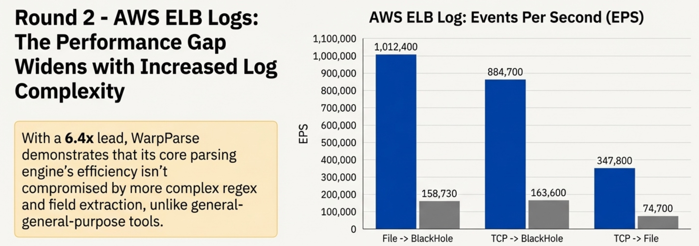

  

<h1 align="center">Warp Parse</h1>

  
  
  

---

Warp Parse is a high-performance Rust ETL engine built for observability, security, real-time risk control, and data platform teams. It focuses on log/telemetry ingestion, parsing, and transformation, providing extreme throughput parsing (WPL), transformation (OML), routing, unified connector APIs, and streamlined operations.

> 📚 **Documentation:** `docs/` (mdBook) • 📊 **Performance:** `docs/performance.md`

## ✨ Core Features

- **🚀 Extreme throughput:** Outperforms Vector across numerous scenarios (see `docs/performance.md`).
- **📝 Readable rules:** WPL (parse DSL) + OML (transform DSL) offer far better readability than regular expressions and Lua.
- **🔌 Unified connectors:** Based on `wp-connector-api` for easy community ecosystem extension.
- **🛠️ Ops friendly:** Single binary deployment, configuration-based; provides `wproj`, `wpgen`, `wprescue` tool suite.
- **🧠 Knowledge transformation:** Enables data enrichment through SQL queries with in-memory database.
- **🎯 Data routing:** Routes data based on rules and transformation models, supports multi-path replication and filters.

## Performance
WarpParse VS Vector

  

## 🏗️ Git Repository Overview

| Repository | Description |
| ---------- | ----------- |
| [`warp-parse`](https://github.com/wp-labs/warp-parse) | ⭐ WarpParse Community Edition |
| `wp-advanced-api` | Advanced Control Interface |
| `wp-connectors` | Connector Library |
| `wp-docs` | Documentation |
| `wp-engine` | Engine Core |
| `wp-example` | Usage Examples |
| `wp-infras` | Infrastructure Library |
| `wp-rule` | Rule Library |
| `wp-open-api` | Open Extension Interface |

## 📄 License

Elastic License 2.0 (ELv2) - see [LICENSE](LICENSE) for details.

---

# Warp Parse（中文版）

  <strong>高性能 Rust ETL 引擎，专为极致日志处理而设计</strong>

---

Warp Parse 是面向可观测性、安全、实时风控、数据平台团队的高性能 ETL 引擎，专注于日志/事件接入、解析与转换，提供高吞吐解析（WPL）、转换（OML）、路由、统一连接器 API 及极简运维体验。

> 📚 **文档位置：** `docs/` (mdBook) • 📊 **性能数据：** `docs/performance.md`

## ✨ 核心特性

- **🚀 极致吞吐：** 众多场景下性能全面超越 Vector（详见 `docs/performance.md`）。
- **📝 规则易编写：** WPL（解析 DSL）+ OML（转换 DSL），可读性远超正则表达式和 Lua。
- **🔌 连接器统一：** 基于 `wp-connector-api`，便于社区生态扩展。
- **🛠️ 运维友好：** 单二进制部署，配置化；提供 `wproj`、`wpgen`、`wprescue` 工具套件。
- **🧠 知识转换：** 通过内存数据库支持 SQL 查询，实现数据富化。
- **🎯 数据路由：** 基于规则和转换模型进行路由，支持多路复制与过滤器。

## 🏗️ Git 仓库说明

| 仓库 | 说明 |
| ---- | ---- |
| [`warp-parse`](https://github.com/wp-labs/warp-parse) | ⭐ WarpParse 社区版 |
| `wp-open-api` | WarpParse 开放接口 |
| `wp-connectors` | WarpParse 连接器库, 可以在此扩展更多的 connector |
| `wp-docs` | WarpParse 使用文档 |
| `wp-engine` | WarpParse 引擎核心 |
| `wp-example` | WarpParse 使用示例 |
| `wp-infras` | WarpParse 基础库 |
| `wp-rule` | WarpParse 规则库 |
| `wp-advanced-api` | WarpParse 高级控制接口 |

## 📄 许可协议

Elastic License 2.0 (ELv2) - 详情请参阅 [LICENSE](LICENSE)。
