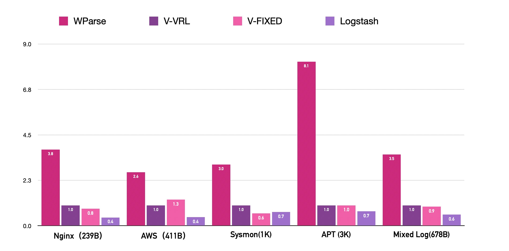

<p align="center">
  
</p>

<h1 align="center">Warp Parse</h1>

<p align="center">
  <a href="https://github.com/wp-labs/warp-parse/actions/workflows/build-and-test.yml">
    
  </a>
  <a href="https://github.com/wp-labs/warp-parse/actions/workflows/release.yml">
    
  </a>
  <a href="https://www.apache.org/licenses/LICENSE-2.0">
    
  </a>
</p>

---

Warp Parse is a high-performance Rust ETL engine built for observability, security, real-time risk control, and data platform teams. It focuses on log/telemetry ingestion, parsing, and transformation, providing extreme throughput parsing (WPL), transformation (OML), routing, unified connector APIs, and streamlined operations.

## ✨ Core Features

- **🚀 Extreme throughput:** EPS (Events Per Second) significantly surpasses Vector across multiple scenarios, with 2~6x performance advantages in core scenarios like fixed rate and large logs (see [Performance Report](https://github.com/wp-labs/wp-examples/tree/main/benchmark/report)).
- **📝 Readable rules:** Self-developed WPL (Parse DSL) + OML (Transform DSL) offer far superior readability and maintainability compared to regular expressions and Lua scripts.
- **🔌 Unified connectors:** Built on standardized `wp-connector-api` interface design, enabling community developers to rapidly extend multi-source log connector ecosystem.
- **🛠️ Ops friendly:** Single binary deployment with full configuration-based management; includes `wproj`, `wpgen`, `wprescue` tool suite to reduce operational costs.
- **🧠 Knowledge transformation:** Built-in in-memory database supports real-time SQL queries for log data field enrichment and correlation analysis.
- **🎯 Data routing:** Flexible routing based on rule engine and transformation models, supporting multi-path data replication, precise filtering, and target distribution.

## Performance
WarpParse VS Vector、LogStash [Report](https://github.com/wp-labs/wp-examples/tree/main/benchmark/report)
<p align="center">
  
</p>

## Setup

```bash
#stable version:
curl  -sSf https://get.warpparse.ai/setup.sh | bash
#beta version:
curl  -sSf https://get.warpparse.ai/beta_setup.sh | bash
#alpha version: 
curl  -sSf https://get.warpparse.ai/alpha_setup.sh | bash

```

## Runtime Admin

Warp Parse currently supports runtime admin operations in daemon mode only.

- Usage guide: [docs/ENGINE_ADMIN_USAGE.md](docs/ENGINE_ADMIN_USAGE.md)
- Status query: `cargo run --bin wproj -- engine status --work-root .`
- Reload trigger: `cargo run --bin wproj -- engine reload --work-root . --reason "manual reload"`

To enable the admin API, configure `[admin_api]` in `conf/wparse.toml`, create `${HOME}/.warp_parse/admin_api.token`, and start:

```bash
cargo run --bin wparse -- daemon --work-root .
```

## 🤝 Community & Collaboration

### 1. Developer Contributions
We welcome all developers to participate in WarpParse development, whether it's feature development, bug fixes, or documentation improvements:
- Contribution Guide: [CONTRIBUTING.md](CONTRIBUTING.md) (Includes PR submission process, code standards, and Issue feedback templates)
- Issue Tracking: [GitHub Issues](https://github.com/wp-labs/warp-parse/issues)
- Community Discussion: GitHub Discussions

### 2. Enterprise/Vendor Partnerships
If your product is a **security threat detection platform, operations observability system, or cloud-native logging service** and requires high-performance log parsing capabilities:
- You can directly integrate WarpParse open-source edition for free - we provide comprehensive technical documentation and integration guide support;
- For customized adaptation, joint solution testing, or performance tuning, contact us via: coop@warpparse.ai
> Note: After integration, simply mention "Built with WarpParse high-performance log parsing engine" in your product's technical documentation - no additional authorization required.

## 📄 License

**WarpParse core engine and supporting toolchain (including WPL/OML parsers, wp-connector-api, tool suite, etc.) are licensed under Apache License 2.0.**

You are free to use, modify, and distribute the source code and derivative works of this project. When embedding into closed-source commercial products, you do not need to open-source your proprietary business code; when distributing modified derivative works, you must retain this license statement and copyright information.

For details, please refer to the [LICENSE](LICENSE) file in the repository root.

---

# Warp Parse（中文版）

<p align="center">
  <strong>高性能 Rust ETL 引擎，专为极致日志处理而设计</strong>
</p>

---

面向可观测性、安全、实时风控、数据平台团队的高性能 ETL 引擎，专注于日志/事件接入、解析与转换，提供高吞吐解析（WPL）、转换（OML）、路由、统一连接器 API 及极简运维体验。

## ✨ 核心特性

- **🚀 极致吞吐：** 多场景下 EPS（事件处理速率）全面超越 Vector，固定速率/大日志等核心场景性能优势达 2~6 倍（详见[性能测试报告](https://github.com/wp-labs/wp-examples/tree/main/benchmark/report)）。
- **📝 规则易编写：** 自研 WPL（解析 DSL）+ OML（转换 DSL），可读性、可维护性远超正则表达式与 Lua 脚本。
- **🔌 连接器统一：** 基于 `wp-connector-api` 标准化接口设计，支持社区开发者快速扩展多源日志连接器生态。
- **🛠️ 运维友好：** 单二进制文件部署，全配置化管理；配套 `wproj`、`wpgen`、`wprescue` 工具套件，降低运维成本。
- **🧠 知识转换：** 内置内存数据库支持 SQL 实时查询，实现日志数据字段富化与关联分析。
- **🎯 数据路由：** 基于规则引擎与转换模型的灵活路由，支持多路数据复制、精准过滤与目标分发。

## 🤝 社区与合作

### 1. 开发者贡献
我们欢迎所有开发者参与 WarpParse 的迭代，无论是功能开发、Bug 修复还是文档完善：
- 贡献指南：[CONTRIBUTING.md](CONTRIBUTING.md)（内含 PR 提交流程、代码规范、Issue 反馈模板）
- 问题反馈：[GitHub Issues](https://github.com/wp-labs/warp-parse/issues)
- 交流社群：GitHub Discussions

### 2. 企业/厂商合作
如果你的产品是 **安全威胁检测平台、运维观测系统、云原生日志服务**，需要高性能日志解析能力：
- 可直接免费集成 WarpParse 开源版，我们提供完整的技术文档与集成指南支持；
- 如需定制化适配、联合方案测试、性能调优，可通过官方邮箱联系：coop@warpparse.ai
> 注：集成后只需在你的产品技术文档中注明「基于 WarpParse 高性能日志解析引擎构建」，无需额外申请授权。

## 📄 许可协议

**WarpParse 核心引擎及配套工具链（含 WPL/OML 解析器、wp-connector-api、工具套件等）均采用 Apache License 2.0 开源协议授权**。

你可自由使用、修改、分发本项目源码及衍生作品，嵌入闭源商业产品时无需开源自有业务代码；分发修改后的衍生作品时，需保留本协议声明及版权信息。

详情请参阅仓库根目录 [LICENSE](LICENSE) 文件。
